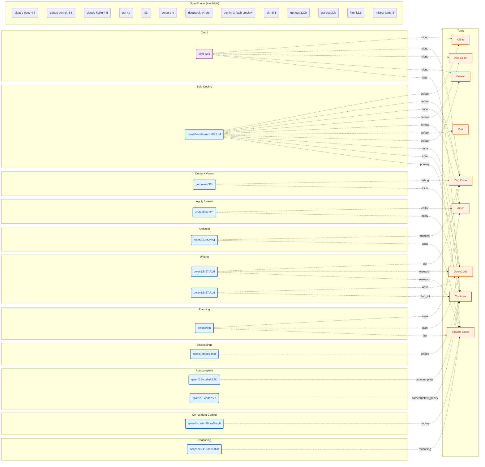

# Model Map — macbook-m5-64gb

## Assignments by Category

### Solo Coding

| Model | Tool | Role |
|------|------|------|
| `qwen3-coder-next-80b:q4 (48 GB)` | Aider | default |
| `qwen3-coder-next-80b:q4 (48 GB)` | ClaudeCode | primary |
| `qwen3-coder-next-80b:q4 (48 GB)` | Cline | default |
| `qwen3-coder-next-80b:q4 (48 GB)` | Continue | chat |
| `qwen3-coder-next-80b:q4 (48 GB)` | Cursor | default |
| `qwen3-coder-next-80b:q4 (48 GB)` | KiloCode | default |
| `qwen3-coder-next-80b:q4 (48 GB)` | OpenCode | code |
| `qwen3-coder-next-80b:q4 (48 GB)` | Zed | default |
| `qwen3-coder-next-80b:q4 (48 GB)` | ZooCode | code |
| `qwen3-coder-next-80b:q4 (48 GB)` | ZooCode | default |

### Co-resident Coding

| Model | Tool | Role |
|------|------|------|
| `qwen3-coder-30b-a3b:q6 (26 GB)` | ClaudeCode | coding |

### Architect

| Model | Tool | Role |
|------|------|------|
| `qwen3.6-35b:q4 (22 GB)` | ClaudeCode | opus |
| `qwen3.6-35b:q4 (22 GB)` | ZooCode | architect |

### Dense / Vision

| Model | Tool | Role |
|------|------|------|
| `gemma4:31b (20 GB)` | OpenCode | think |
| `gemma4:31b (20 GB)` | ZooCode | debug |

### Writing

| Model | Tool | Role |
|------|------|------|
| `qwen3.5-27b:q5 (19 GB)` | ClaudeCode | research |
| `qwen3.5-27b:q5 (19 GB)` | OpenCode | research |
| `qwen3.5-27b:q5 (19 GB)` | ZooCode | ask |
| `qwen3.5-27b:q8 (19 GB)` | Continue | chat_alt |
| `qwen3.5-27b:q8 (19 GB)` | OpenCode | write |

### Reasoning

| Model | Tool | Role |
|------|------|------|
| `deepseek-r1-tools:32b (20 GB)` | ClaudeCode | reasoning |

### Planning

| Model | Tool | Role |
|------|------|------|
| `qwen3:4b (5 GB)` | Aider | weak |
| `qwen3:4b (5 GB)` | ClaudeCode | fast |
| `qwen3:4b (5 GB)` | OpenCode | plan |

### Apply / Insert

| Model | Tool | Role |
|------|------|------|
| `codestral:22b (23 GB)` | Aider | editor |
| `codestral:22b (23 GB)` | Continue | apply |

### Autocomplete

| Model | Tool | Role |
|------|------|------|
| `qwen2.5-coder:1.5b (1 GB)` | Continue | autocomplete |
| `qwen2.5-coder:7b (5 GB)` | Continue | autocomplete_heavy |

### Embeddings

| Model | Tool | Role |
|------|------|------|
| `nomic-embed-text (0.3 GB)` | Continue | embed |

### Cloud

| Model | Tool | Role |
|------|------|------|
| `kimi-k2.6` | Cline | cloud |
| `kimi-k2.6` | Continue | kimi |
| `kimi-k2.6` | Cursor | cloud |
| `kimi-k2.6` | KiloCode | cloud |
| `kimi-k2.6` | ZooCode | cloud |

## Flow Diagram

## OpenRouter (cloud)

The following models are available via OpenRouter but not stored locally:

- claude-opus-4-6
- claude-sonnet-4-6
- claude-haiku-4-5
- gpt-4o
- o3
- sonar-pro
- deepseek-v4-pro
- gemini-3-flash-preview
- glm-5.1
- gpt-oss:120b
- gpt-oss:20b
- kimi-k2.6
- mistral-large-3

---
Generated by `generate-model-map.sh` for profile `macbook-m5-64gb`. Edit `models.sh` and re-run to regenerate.
