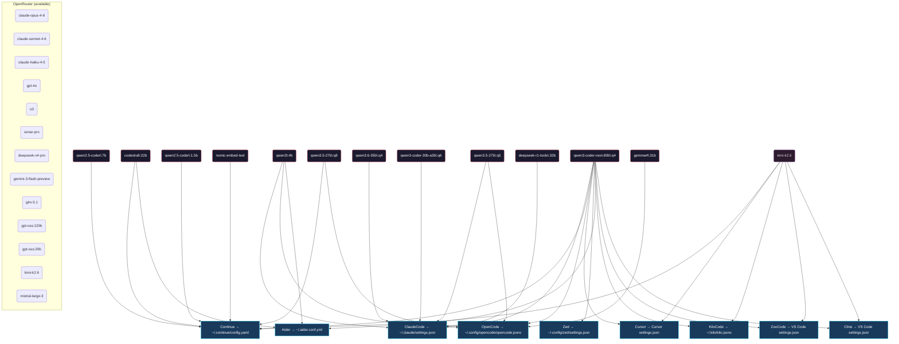

# Model Map — macbook-m5-64gb

```mermaid
graph TB

    codestral_22b("codestral\:22b")
    deepseek_r1_tools_32b("deepseek-r1-tools\:32b")
    gemma4_31b("gemma4\:31b")
    kimi_k2_6("kimi-k2.6")
    nomic_embed_text("nomic-embed-text")
    qwen2_5_coder_1_5b("qwen2.5-coder\:1.5b")
    qwen2_5_coder_7b("qwen2.5-coder\:7b")
    qwen3_coder_30b_a3b_q6("qwen3-coder-30b-a3b\:q6")
    qwen3_coder_next_80b_q4("qwen3-coder-next-80b\:q4")
    qwen3_5_27b_q5("qwen3.5-27b\:q5")
    qwen3_5_27b_q8("qwen3.5-27b\:q8")
    qwen3_6_35b_q4("qwen3.6-35b\:q4")
    qwen3_4b("qwen3\:4b")

    %% Tool nodes → config destinations
    Cline["Cline → VS Code settings.json"]
    ZooCode["ZooCode → VS Code settings.json"]
    KiloCode["KiloCode → ~/.kilo/kilo.jsonc"]
    Aider["Aider → ~/.aider.conf.yml"]
    Zed["Zed → ~/.config/zed/settings.json"]
    Cursor["Cursor → Cursor settings.json"]
    OpenCode["OpenCode → ~/.config/opencode/opencode.jsonc"]
    Continue["Continue → ~/.continue/config.yaml"]
    ClaudeCode["ClaudeCode → ~/.claude/settings.json"]

    %% Edges: model → tool
    codestral_22b --> Aider
    codestral_22b --> Continue
    deepseek_r1_tools_32b --> ClaudeCode
    gemma4_31b --> OpenCode
    kimi_k2_6 --> Cline
    kimi_k2_6 --> ZooCode
    kimi_k2_6 --> KiloCode
    kimi_k2_6 --> Cursor
    kimi_k2_6 --> Continue
    nomic_embed_text --> Continue
    qwen2_5_coder_1_5b --> Continue
    qwen2_5_coder_7b --> Continue
    qwen3_coder_30b_a3b_q6 --> ClaudeCode
    qwen3_coder_next_80b_q4 --> Cline
    qwen3_coder_next_80b_q4 --> ZooCode
    qwen3_coder_next_80b_q4 --> KiloCode
    qwen3_coder_next_80b_q4 --> Aider
    qwen3_coder_next_80b_q4 --> Zed
    qwen3_coder_next_80b_q4 --> Cursor
    qwen3_coder_next_80b_q4 --> OpenCode
    qwen3_coder_next_80b_q4 --> Continue
    qwen3_coder_next_80b_q4 --> ClaudeCode
    qwen3_5_27b_q5 --> OpenCode
    qwen3_5_27b_q5 --> ClaudeCode
    qwen3_5_27b_q8 --> OpenCode
    qwen3_5_27b_q8 --> Continue
    qwen3_6_35b_q4 --> ClaudeCode
    qwen3_4b --> Aider
    qwen3_4b --> OpenCode
    qwen3_4b --> ClaudeCode

    %% Styles
    classDef local fill:#1a1a2e,stroke:#e94560,color:#fff
    classDef tool fill:#1a3a5c,stroke:#00d2ff,color:#fff
    classDef cloud fill:#2d1b2e,stroke:#9b59b6,color:#ddd
    class codestral_22b local
    class deepseek_r1_tools_32b local
    class gemma4_31b local
    class kimi_k2_6 cloud
    class nomic_embed_text local
    class qwen2_5_coder_1_5b local
    class qwen2_5_coder_7b local
    class qwen3_coder_30b_a3b_q6 local
    class qwen3_coder_next_80b_q4 local
    class qwen3_5_27b_q5 local
    class qwen3_5_27b_q8 local
    class qwen3_6_35b_q4 local
    class qwen3_4b local
    class Cline tool
    class ZooCode tool
    class KiloCode tool
    class Aider tool
    class Zed tool
    class Cursor tool
    class OpenCode tool
    class Continue tool
    class ClaudeCode tool

    %% OpenRouter reference models
    subgraph OpenRouterAvailable ["OpenRouter (available)"]
    or_claude_opus_4_6("claude-opus-4-6")
    or_claude_sonnet_4_6("claude-sonnet-4-6")
    or_claude_haiku_4_5("claude-haiku-4-5")
    or_gpt_4o("gpt-4o")
    or_o3("o3")
    or_sonar_pro("sonar-pro")
    or_deepseek_v4_pro("deepseek-v4-pro")
    or_gemini_3_flash_preview("gemini-3-flash-preview")
    or_glm_5_1("glm-5.1")
    or_gpt_oss_120b("gpt-oss:120b")
    or_gpt_oss_20b("gpt-oss:20b")
    or_kimi_k2_6("kimi-k2.6")
    or_mistral_large_3("mistral-large-3")
    end
```

Generated by `generate-model-map.sh` for profile `macbook-m5-64gb`.
Edit `models.sh` and re-run to regenerate.
