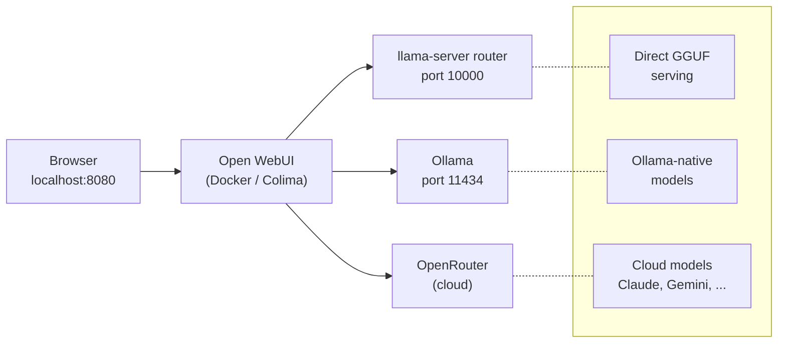

# llama-server Router + Open WebUI: Three-Backend Workflow

How the AI inference stack is laid out, how to start/verify each piece, and how
Open WebUI combines them into one chat interface.

## Architecture



Two key ports on localhost:

| Port | Service | What it does |
| ---- | ------- | ------------ |
| **8080** | Open WebUI | The chat UI you open in a browser |
| **10000** | llama-server router | Model inference (no UI, just API) |

The container reaches the host via `host.docker.internal`.

---

## 1. Run the llama-server router (port 10000)

The router is a [`llama-server`](https://github.com/ggerganov/llama.cpp) instance
running in **router mode** with dynamic model loading. It serves GGUFs directly
from `/usr/local/lib/llama-models`.

### Start

Auto-started at login via the LaunchAgent. To start manually:

```bash
launchctl bootstrap gui/$(id -u) ~/Library/LaunchAgents/org.kehle.llama-router.plist
```

### Verify

```bash
# 9 models expected: 3 named presets + 6 auto-discovered
curl -s http://127.0.0.1:10000/v1/models | jq '.data[].id'

# LaunchAgent health (should show PID)
launchctl list | grep llama-router

# Chat smoke test (fast model, ~2.5 GB — responds instantly)
curl -s http://127.0.0.1:10000/v1/chat/completions \
  -H "Content-Type: application/json" \
  -d '{"model":"qwen3-4b-it","messages":[{"role":"user","content":"Hi"}]}' \
  | jq -r '.choices[0].message.content'
```

### Restart

```bash
launchctl bootout gui/$(id -u)/org.kehle.llama-router
launchctl bootstrap gui/$(id -u) ~/Library/LaunchAgents/org.kehle.llama-router.plist
```

### Build from source (when updating llama.cpp)

```bash
cd ~/code/isaackehle/settings/ai/router
./build.sh     # pulls latest llama.cpp, builds with Metal
./setup.sh     # patches models.ini, installs LaunchAgent
```

---

## 2. Models served by the router

| API model ID | GGUF file | Role | Size |
| ------------ | --------- | ---- | ---- |
| `qwen3-4b-it` | `qwen3-4b-it-q4_k_m.gguf` | Fast chat / default | ~2.5 GB |
| `qwen3-coder-30b` | `qwen3-coder-30b-a3b-cd-ud-q6_k_xl.gguf` | Coding | ~26 GB |
| `deepseek-r1-32b` | `deepseek-r1-32b-ds-q4_k_m.gguf` | Reasoning | ~19 GB |

Plus 6 auto-discovered models from GGUF filenames in
`/usr/local/lib/llama-models/` (e.g., `qwen3-coder-next-80b-cd-q4_k_m`,
`nomic-embed-text-em-f16`).

---

## 3. Run Open WebUI (port 8080)

Open WebUI runs in a Docker container under **Colima** and acts as the single
chat frontend. It's configured to connect to all three backends simultaneously.

### Start / restart

```bash
export DOCKER_HOST="unix:///Users/isaac/.colima/default/docker.sock"
docker stop openwebui 2>/dev/null; docker rm openwebui 2>/dev/null

set -a; source ~/.env.local; set +a  # loads OPENROUTER_API_KEY

docker run -d \
  --name openwebui \
  --restart unless-stopped \
  -p 8080:8080 \
  --add-host=host.docker.internal:host-gateway \
  -e ENABLE_OLLAMA_API=true \
  -e OLLAMA_BASE_URL=http://host.docker.internal:11434 \
  -e OPENAI_API_BASE_URLS="http://host.docker.internal:10000/v1;https://openrouter.ai/api/v1" \
  -e OPENAI_API_KEYS="sk-local;${OPENROUTER_API_KEY}" \
  -v open-webui:/app/backend/data \
  ghcr.io/open-webui/open-webui:main
```

### Access

Open **http://localhost:8080** in a browser. The model dropdown lists models
from all three backends.

---

## 4. Three backend paths explained

| Backend | Port / URL | Models available | Auth |
| ------- | ---------- | ---------------- | ---- |
| **llama-server router** | `host.docker.internal:10000` | 9 local GGUF-served models | `sk-local` (any non-empty key) |
| **Ollama** | `host.docker.internal:11434` | 29 local Ollama models | none |
| **OpenRouter** | `openrouter.ai/api/v1` | 300+ cloud models (Claude, Gemini, etc.) | `OPENROUTER_API_KEY` |

The `OPENAI_API_BASE_URLS` and `OPENAI_API_KEYS` env vars are semicolon-separated
lists — index 0 = llama-server, index 1 = OpenRouter. Ollama gets its own
native connection via `OLLAMA_BASE_URL`.

### Verify from inside the container

```bash
export DOCKER_HOST="unix:///Users/isaac/.colima/default/docker.sock"

# Router backends
docker exec openwebui sh -c 'curl -s http://host.docker.internal:10000/v1/models' | python3 -c "import sys,json; [print(x['id']) for x in json.load(sys.stdin)['data']]"

# Ollama models
docker exec openwebui sh -c 'curl -s http://host.docker.internal:11434/api/tags' | python3 -c "import sys,json; [print(x['name']) for x in json.load(sys.stdin)['models']]"

# OpenRouter models (top 3)
docker exec openwebui sh -c 'curl -s -H "Authorization: Bearer $(echo $OPENAI_API_KEYS | cut -d";" -f2)" https://openrouter.ai/api/v1/models' | python3 -c "import sys,json; [print(x['id']) for x in json.load(sys.stdin).get('data',[])[:3]]"
```

---

## 5. Usage

1. Open **http://localhost:8080** in a browser.
2. In the chat model dropdown, models from all three backends appear together:
   - **Router models**: `qwen3-4b-it`, `qwen3-coder-30b`, `deepseek-r1-32b`, etc.
   - **Ollama models**: `qwen3.5-27b:q4`, `qwen3-coder-30b-a3b:q6`, etc.
   - **OpenRouter models**: `anthropic/claude-sonnet-4-6`, `google/gemini-2.5-pro`, etc.
3. Pick any model per chat — each chat session is independent.

---

## 6. Troubleshooting

| Symptom | Likely cause |
| ------- | ----------- |
| Router models missing from dropdown | Router down. Check `launchctl list \| grep llama-router` or restart. |
| Ollama models missing | Ollama bound to `127.0.0.1`. Set `OLLAMA_HOST=0.0.0.0:11434` and restart. |
| OpenRouter 401 | Key not passed. Check `~/.env.local` has `OPENROUTER_API_KEY` set. |
| Container can't reach host | Ensure `--add-host=host.docker.internal:host-gateway` on `docker run`. |
| Port 8080 shows "ssh" in `lsof` | Normal — Colima port-forward, not a problem. |

---

## References

- [Full router setup docs](../ai/router/README.md)
- [Open WebUI integration details](../ai/router/open-webui-integration.md)
- [Router performance tuning guide](../ai/router/tuning-guide.md)
- [Router health check suite](llama-router-testing.md)
