# Model Map — macbook-m5-48gb

## Hugging Face → GGUF → Ollama Materialization

This is the profile-specific install graph: Hugging Face source repo, exact remote GGUF filename, normalized local artifact name, Ollama alias, MODELFILE parameters, and context-window aliases.

| Ollama alias              | HF repo                                                                                | Remote GGUF                                                                | Quant        | Local GGUF                                  | Family             | Base num_ctx | Context aliases | MODELFILE params                                         |
| ------------------------- | -------------------------------------------------------------------------------------- | -------------------------------------------------------------------------- | ------------ | ------------------------------------------- | ------------------ | -----------: | --------------- | -------------------------------------------------------- |
| `codestral:22b`           | `hf.co/bartowski/Codestral-22B-v0.1-GGUF`                                              | `Codestral-22B-v0.1-Q4_K_M.gguf`                                           | `Q4_K_M`     | `codestral-22b-cd-q4_k_m.gguf`              | `coder`            |          `—` | —               | —                                                        |
| `deepseek-r1:32b`         | `hf.co/bartowski/DeepSeek-R1-Distill-Qwen-32B-GGUF`                                    | `DeepSeek-R1-Distill-Qwen-32B-Q4_K_M.gguf`                                 | `Q4_K_M`     | `deepseek-r1-32b-ds-q4_k_m.gguf`            | `reasoning-tools`  |     `131072` | —               | PARAMETER temperature 0.3                                |
| `gemma4:31b`              | `hf.co/google/gemma-4-31b-it-GGUF`                                                     | `gemma-4-31b-it-Q4_K_M.gguf`                                               | `Q4_K_M`     | `gemma4-31b-it-q4_k_m.gguf`                 | `vision-instruct`  |          `—` | —               | —                                                        |
| `nomic-embed-text`        | `hf.co/nomic-ai/nomic-embed-text-v1.5-GGUF`                                            | `nomic-embed-text-v1.5.f16.gguf`                                           | `F16`        | `nomic-embed-text-em-f16.gguf`              | `embedding`        |       `8192` | —               | —                                                        |
| `qwen2.5-7b:multi`        | `hf.co/mradermacher/Qwen2.5-7B-Instruct-1M-Thinking-Claude-Gemini-GPT5.2-DISTILL-GGUF` | `Qwen2.5-7B-Instruct-1M-Thinking-Claude-Gemini-GPT5.2-DISTILL.Q4_K_M.gguf` | `Q4_K_M`     | `qwen2.5-7b-multi-it-ds-q4_k_m.gguf`        | `instruct-distill` |    `1010000` | —               | PARAMETER temperature 0.6                                |
| `qwen2.5-coder:1.5b`      | `hf.co/Qwen/Qwen2.5-Coder-1.5B-Instruct-GGUF`                                          | `qwen2.5-coder-1.5b-instruct-q4_k_m.gguf`                                  | `Q4_K_M`     | `qwen2.5-coder-1.5b-cd-q4_k_m.gguf`         | `coder`            |          `—` | —               | —                                                        |
| `qwen2.5-coder:7b`        | `hf.co/Qwen/Qwen2.5-Coder-7B-Instruct-GGUF`                                            | `qwen2.5-coder-7b-instruct-q4_k_m.gguf`                                    | `Q4_K_M`     | `qwen2.5-coder-7b-cd-q4_k_m.gguf`           | `coder`            |          `—` | —               | —                                                        |
| `qwen3-14b:sonnet4.5`     | `hf.co/TeichAI/Qwen3-14B-Claude-Sonnet-4.5-Reasoning-Distill-GGUF`                     | `Qwen3-14B-claude-sonnet-4.5-high-reasoning-distill-Q4_K_M.gguf`           | `Q4_K_M`     | `qwen3-14b-sonnet4.5-it-ds-q4_k_m.gguf`     | `instruct-distill` |      `40960` | —               | PARAMETER temperature 0.6                                |
| `qwen3-8b:sonnet4.5`      | `hf.co/TeichAI/Qwen3-8B-Claude-Sonnet-4.5-Reasoning-Distill-GGUF`                      | `Qwen3-8B-claude-sonnet-4.5-high-reasoning-distill-Q4_K_M.gguf`            | `Q4_K_M`     | `qwen3-8b-sonnet4.5-it-ds-q4_k_m.gguf`      | `instruct-distill` |      `40960` | —               | PARAMETER temperature 0.6                                |
| `qwen3-coder-30b-a3b:q5`  | `hf.co/unsloth/Qwen3-Coder-30B-A3B-Instruct-GGUF`                                      | `Qwen3-Coder-30B-A3B-Instruct-Q5_K_M.gguf`                                 | `Q5_K_M`     | `qwen3-coder-30b-a3b-cd-q5_k_m.gguf`        | `coder`            |      `32768` | —               | PARAMETER temperature 0 PARAMETER repeat_penalty 1.05 |
| `qwen3-coder-30b-a3b:q6`  | `hf.co/unsloth/Qwen3-Coder-30B-A3B-Instruct-GGUF`                                      | `Qwen3-Coder-30B-A3B-Instruct-Q6_K.gguf`                                   | `Q6_K`       | `qwen3-coder-30b-a3b-cd-q6_k.gguf`          | `coder`            |      `32768` | —               | PARAMETER temperature 0 PARAMETER repeat_penalty 1.05 |
| `qwen3:4b`                | `hf.co/Qwen/Qwen3-4B-GGUF`                                                             | `Qwen3-4B-Q4_K_M.gguf`                                                     | `Q4_K_M`     | `qwen3-4b-it-q4_k_m.gguf`                   | `instruct`         |     `131072` | —               | PARAMETER temperature 0.2                                |
| `qwen3.5-27b:gemini3.1`   | `hf.co/Jackrong/Qwen3.5-27B-Gemini-3.1-Pro-Reasoning-Distill-GGUF`                     | `Qwen3.5-27B.Q4_K_M.gguf`                                                  | `Q4_K_M`     | `qwen3.5-27b-gemini3.1-it-ds-q4_k_m.gguf`   | `instruct-distill` |     `262144` | —               | PARAMETER temperature 0.6                                |
| `qwen3.5-27b:q4`          | `hf.co/Jackrong/Qwen3.5-27B-Claude-4.6-Opus-Reasoning-Distilled-GGUF`                  | `Qwen3.5-27B.Q4_K_M.gguf`                                                  | `Q4_K_M`     | `qwen3.5-27b-opus4.6-it-ds-q4_k_m.gguf`     | `instruct-distill` |      `32768` | —               | PARAMETER temperature 0.6                                |
| `qwen3.5:4b`              | `hf.co/unsloth/Qwen3.5-4B-GGUF`                                                        | `Qwen3.5-4B-UD-Q4_K_XL.gguf`                                               | `UD-Q4_K_XL` | `qwen3.5-4b-it-ud-q4_k_xl.gguf`             | `instruct`         |     `131072` | —               | PARAMETER temperature 0.2                                |
| `qwen3.6-27b:opus-sonnet` | `hf.co/Brian6145/Qwen3.6-27B-Claude-Opus-Sonnet-DistilledV2-MTP-GGUF`                  | `Qwen3.6-27B-Claude-Opus-Sonnet-DistilledV2-MTP-Q4_K_M.gguf`               | `Q4_K_M`     | `qwen3.6-27b-opus-sonnet-it-ds-q4_k_m.gguf` | `instruct-distill` |     `262144` | —               | PARAMETER temperature 0.6                                |
| `qwen3.6-35b:opus4.6`     | `hf.co/hesamation/Qwen3.6-35B-A3B-Claude-4.6-Opus-Reasoning-Distilled-GGUF`            | `Qwen3.6-35B-A3B-Claude-4.6-Opus-Reasoning-Distilled.Q4_K_M.gguf`          | `Q4_K_M`     | `qwen3.6-35b-opus4.6-it-ds-q4_k_m.gguf`     | `instruct-distill` |      `32768` | —               | PARAMETER temperature 0.5                                |

### Materialization graph

```mermaid
flowchart LR
  classDef hf fill:#eef6ff,stroke:#4b8bbe,color:#111;
  classDef file fill:#f7f7f7,stroke:#999,color:#111;
  classDef ollama fill:#edf7ed,stroke:#4f9d5d,color:#111;
  classDef params fill:#fff7e6,stroke:#d99000,color:#111;
  hf_hf_co_bartowski_Codestral_22B_v0_1_GGUF["HF: hf.co/bartowski/Codestral-22B-v0.1-GGUF"]:::hf
  remote_hf_co_bartowski_Codestral_22B_v0_1_GGUF_Codestral_22B_v0_1_Q4_K_M_gguf["Remote GGUF: Codestral-22B-v0.1-Q4_K_M.gguf"]:::file
  local_codestral_22b_cd_q4_k_m_gguf["Local GGUF: codestral-22b-cd-q4_k_m.gguf"]:::file
  ollama_codestral_22b["Ollama: codestral:22b\nquant=Q4_K_M; family=coder"]:::ollama
  hf_hf_co_bartowski_Codestral_22B_v0_1_GGUF --> remote_hf_co_bartowski_Codestral_22B_v0_1_GGUF_Codestral_22B_v0_1_Q4_K_M_gguf --> local_codestral_22b_cd_q4_k_m_gguf --> ollama_codestral_22b
  hf_hf_co_bartowski_DeepSeek_R1_Distill_Qwen_32B_GGUF["HF: hf.co/bartowski/DeepSeek-R1-Distill-Qwen-32B-GGUF"]:::hf
  remote_hf_co_bartowski_DeepSeek_R1_Distill_Qwen_32B_GGUF_DeepSeek_R1_Distill_Qwen_32B_Q4_K_M_gguf["Remote GGUF: DeepSeek-R1-Distill-Qwen-32B-Q4_K_M.gguf"]:::file
  local_deepseek_r1_32b_ds_q4_k_m_gguf["Local GGUF: deepseek-r1-32b-ds-q4_k_m.gguf"]:::file
  ollama_deepseek_r1_32b["Ollama: deepseek-r1:32b\nquant=Q4_K_M; family=reasoning-tools"]:::ollama
  hf_hf_co_bartowski_DeepSeek_R1_Distill_Qwen_32B_GGUF --> remote_hf_co_bartowski_DeepSeek_R1_Distill_Qwen_32B_GGUF_DeepSeek_R1_Distill_Qwen_32B_Q4_K_M_gguf --> local_deepseek_r1_32b_ds_q4_k_m_gguf --> ollama_deepseek_r1_32b
  params_deepseek_r1_32b["MODELFILE params"]:::params
  params_deepseek_r1_32b -.-> ollama_deepseek_r1_32b
  hf_hf_co_google_gemma_4_31b_it_GGUF["HF: hf.co/google/gemma-4-31b-it-GGUF"]:::hf
  remote_hf_co_google_gemma_4_31b_it_GGUF_gemma_4_31b_it_Q4_K_M_gguf["Remote GGUF: gemma-4-31b-it-Q4_K_M.gguf"]:::file
  local_gemma4_31b_it_q4_k_m_gguf["Local GGUF: gemma4-31b-it-q4_k_m.gguf"]:::file
  ollama_gemma4_31b["Ollama: gemma4:31b\nquant=Q4_K_M; family=vision-instruct"]:::ollama
  hf_hf_co_google_gemma_4_31b_it_GGUF --> remote_hf_co_google_gemma_4_31b_it_GGUF_gemma_4_31b_it_Q4_K_M_gguf --> local_gemma4_31b_it_q4_k_m_gguf --> ollama_gemma4_31b
  hf_hf_co_nomic_ai_nomic_embed_text_v1_5_GGUF["HF: hf.co/nomic-ai/nomic-embed-text-v1.5-GGUF"]:::hf
  remote_hf_co_nomic_ai_nomic_embed_text_v1_5_GGUF_nomic_embed_text_v1_5_f16_gguf["Remote GGUF: nomic-embed-text-v1.5.f16.gguf"]:::file
  local_nomic_embed_text_em_f16_gguf["Local GGUF: nomic-embed-text-em-f16.gguf"]:::file
  ollama_nomic_embed_text["Ollama: nomic-embed-text\nquant=F16; family=embedding"]:::ollama
  hf_hf_co_nomic_ai_nomic_embed_text_v1_5_GGUF --> remote_hf_co_nomic_ai_nomic_embed_text_v1_5_GGUF_nomic_embed_text_v1_5_f16_gguf --> local_nomic_embed_text_em_f16_gguf --> ollama_nomic_embed_text
  hf_hf_co_mradermacher_Qwen2_5_7B_Instruct_1M_Thinking_Claude_Gemini_GPT5_2_DISTILL_GGUF["HF: hf.co/mradermacher/Qwen2.5-7B-Instruct-1M-Thinking-Claude-Gemini-GPT5.2-DISTILL-GGUF"]:::hf
  remote_hf_co_mradermacher_Qwen2_5_7B_Instruct_1M_Thinking_Claude_Gemini_GPT5_2_DISTILL_GGUF_Qwen2_5_7B_Instruct_1M_Thinking_Claude_Gemini_GPT5_2_DISTILL_Q4_K_M_gguf["Remote GGUF: Qwen2.5-7B-Instruct-1M-Thinking-Claude-Gemini-GPT5.2-DISTILL.Q4_K_M.gguf"]:::file
  local_qwen2_5_7b_multi_it_ds_q4_k_m_gguf["Local GGUF: qwen2.5-7b-multi-it-ds-q4_k_m.gguf"]:::file
  ollama_qwen2_5_7b_multi["Ollama: qwen2.5-7b:multi\nquant=Q4_K_M; family=instruct-distill"]:::ollama
  hf_hf_co_mradermacher_Qwen2_5_7B_Instruct_1M_Thinking_Claude_Gemini_GPT5_2_DISTILL_GGUF --> remote_hf_co_mradermacher_Qwen2_5_7B_Instruct_1M_Thinking_Claude_Gemini_GPT5_2_DISTILL_GGUF_Qwen2_5_7B_Instruct_1M_Thinking_Claude_Gemini_GPT5_2_DISTILL_Q4_K_M_gguf --> local_qwen2_5_7b_multi_it_ds_q4_k_m_gguf --> ollama_qwen2_5_7b_multi
  params_qwen2_5_7b_multi["MODELFILE params"]:::params
  params_qwen2_5_7b_multi -.-> ollama_qwen2_5_7b_multi
  hf_hf_co_Qwen_Qwen2_5_Coder_1_5B_Instruct_GGUF["HF: hf.co/Qwen/Qwen2.5-Coder-1.5B-Instruct-GGUF"]:::hf
  remote_hf_co_Qwen_Qwen2_5_Coder_1_5B_Instruct_GGUF_qwen2_5_coder_1_5b_instruct_q4_k_m_gguf["Remote GGUF: qwen2.5-coder-1.5b-instruct-q4_k_m.gguf"]:::file
  local_qwen2_5_coder_1_5b_cd_q4_k_m_gguf["Local GGUF: qwen2.5-coder-1.5b-cd-q4_k_m.gguf"]:::file
  ollama_qwen2_5_coder_1_5b["Ollama: qwen2.5-coder:1.5b\nquant=Q4_K_M; family=coder"]:::ollama
  hf_hf_co_Qwen_Qwen2_5_Coder_1_5B_Instruct_GGUF --> remote_hf_co_Qwen_Qwen2_5_Coder_1_5B_Instruct_GGUF_qwen2_5_coder_1_5b_instruct_q4_k_m_gguf --> local_qwen2_5_coder_1_5b_cd_q4_k_m_gguf --> ollama_qwen2_5_coder_1_5b
  hf_hf_co_Qwen_Qwen2_5_Coder_7B_Instruct_GGUF["HF: hf.co/Qwen/Qwen2.5-Coder-7B-Instruct-GGUF"]:::hf
  remote_hf_co_Qwen_Qwen2_5_Coder_7B_Instruct_GGUF_qwen2_5_coder_7b_instruct_q4_k_m_gguf["Remote GGUF: qwen2.5-coder-7b-instruct-q4_k_m.gguf"]:::file
  local_qwen2_5_coder_7b_cd_q4_k_m_gguf["Local GGUF: qwen2.5-coder-7b-cd-q4_k_m.gguf"]:::file
  ollama_qwen2_5_coder_7b["Ollama: qwen2.5-coder:7b\nquant=Q4_K_M; family=coder"]:::ollama
  hf_hf_co_Qwen_Qwen2_5_Coder_7B_Instruct_GGUF --> remote_hf_co_Qwen_Qwen2_5_Coder_7B_Instruct_GGUF_qwen2_5_coder_7b_instruct_q4_k_m_gguf --> local_qwen2_5_coder_7b_cd_q4_k_m_gguf --> ollama_qwen2_5_coder_7b
  hf_hf_co_TeichAI_Qwen3_14B_Claude_Sonnet_4_5_Reasoning_Distill_GGUF["HF: hf.co/TeichAI/Qwen3-14B-Claude-Sonnet-4.5-Reasoning-Distill-GGUF"]:::hf
  remote_hf_co_TeichAI_Qwen3_14B_Claude_Sonnet_4_5_Reasoning_Distill_GGUF_Qwen3_14B_claude_sonnet_4_5_high_reasoning_distill_Q4_K_M_gguf["Remote GGUF: Qwen3-14B-claude-sonnet-4.5-high-reasoning-distill-Q4_K_M.gguf"]:::file
  local_qwen3_14b_sonnet4_5_it_ds_q4_k_m_gguf["Local GGUF: qwen3-14b-sonnet4.5-it-ds-q4_k_m.gguf"]:::file
  ollama_qwen3_14b_sonnet4_5["Ollama: qwen3-14b:sonnet4.5\nquant=Q4_K_M; family=instruct-distill"]:::ollama
  hf_hf_co_TeichAI_Qwen3_14B_Claude_Sonnet_4_5_Reasoning_Distill_GGUF --> remote_hf_co_TeichAI_Qwen3_14B_Claude_Sonnet_4_5_Reasoning_Distill_GGUF_Qwen3_14B_claude_sonnet_4_5_high_reasoning_distill_Q4_K_M_gguf --> local_qwen3_14b_sonnet4_5_it_ds_q4_k_m_gguf --> ollama_qwen3_14b_sonnet4_5
  params_qwen3_14b_sonnet4_5["MODELFILE params"]:::params
  params_qwen3_14b_sonnet4_5 -.-> ollama_qwen3_14b_sonnet4_5
  hf_hf_co_TeichAI_Qwen3_8B_Claude_Sonnet_4_5_Reasoning_Distill_GGUF["HF: hf.co/TeichAI/Qwen3-8B-Claude-Sonnet-4.5-Reasoning-Distill-GGUF"]:::hf
  remote_hf_co_TeichAI_Qwen3_8B_Claude_Sonnet_4_5_Reasoning_Distill_GGUF_Qwen3_8B_claude_sonnet_4_5_high_reasoning_distill_Q4_K_M_gguf["Remote GGUF: Qwen3-8B-claude-sonnet-4.5-high-reasoning-distill-Q4_K_M.gguf"]:::file
  local_qwen3_8b_sonnet4_5_it_ds_q4_k_m_gguf["Local GGUF: qwen3-8b-sonnet4.5-it-ds-q4_k_m.gguf"]:::file
  ollama_qwen3_8b_sonnet4_5["Ollama: qwen3-8b:sonnet4.5\nquant=Q4_K_M; family=instruct-distill"]:::ollama
  hf_hf_co_TeichAI_Qwen3_8B_Claude_Sonnet_4_5_Reasoning_Distill_GGUF --> remote_hf_co_TeichAI_Qwen3_8B_Claude_Sonnet_4_5_Reasoning_Distill_GGUF_Qwen3_8B_claude_sonnet_4_5_high_reasoning_distill_Q4_K_M_gguf --> local_qwen3_8b_sonnet4_5_it_ds_q4_k_m_gguf --> ollama_qwen3_8b_sonnet4_5
  params_qwen3_8b_sonnet4_5["MODELFILE params"]:::params
  params_qwen3_8b_sonnet4_5 -.-> ollama_qwen3_8b_sonnet4_5
  hf_hf_co_unsloth_Qwen3_Coder_30B_A3B_Instruct_GGUF["HF: hf.co/unsloth/Qwen3-Coder-30B-A3B-Instruct-GGUF"]:::hf
  remote_hf_co_unsloth_Qwen3_Coder_30B_A3B_Instruct_GGUF_Qwen3_Coder_30B_A3B_Instruct_Q5_K_M_gguf["Remote GGUF: Qwen3-Coder-30B-A3B-Instruct-Q5_K_M.gguf"]:::file
  local_qwen3_coder_30b_a3b_cd_q5_k_m_gguf["Local GGUF: qwen3-coder-30b-a3b-cd-q5_k_m.gguf"]:::file
  ollama_qwen3_coder_30b_a3b_q5["Ollama: qwen3-coder-30b-a3b:q5\nquant=Q5_K_M; family=coder"]:::ollama
  hf_hf_co_unsloth_Qwen3_Coder_30B_A3B_Instruct_GGUF --> remote_hf_co_unsloth_Qwen3_Coder_30B_A3B_Instruct_GGUF_Qwen3_Coder_30B_A3B_Instruct_Q5_K_M_gguf --> local_qwen3_coder_30b_a3b_cd_q5_k_m_gguf --> ollama_qwen3_coder_30b_a3b_q5
  params_qwen3_coder_30b_a3b_q5["MODELFILE params"]:::params
  params_qwen3_coder_30b_a3b_q5 -.-> ollama_qwen3_coder_30b_a3b_q5
  hf_hf_co_unsloth_Qwen3_Coder_30B_A3B_Instruct_GGUF["HF: hf.co/unsloth/Qwen3-Coder-30B-A3B-Instruct-GGUF"]:::hf
  remote_hf_co_unsloth_Qwen3_Coder_30B_A3B_Instruct_GGUF_Qwen3_Coder_30B_A3B_Instruct_Q6_K_gguf["Remote GGUF: Qwen3-Coder-30B-A3B-Instruct-Q6_K.gguf"]:::file
  local_qwen3_coder_30b_a3b_cd_q6_k_gguf["Local GGUF: qwen3-coder-30b-a3b-cd-q6_k.gguf"]:::file
  ollama_qwen3_coder_30b_a3b_q6["Ollama: qwen3-coder-30b-a3b:q6\nquant=Q6_K; family=coder"]:::ollama
  hf_hf_co_unsloth_Qwen3_Coder_30B_A3B_Instruct_GGUF --> remote_hf_co_unsloth_Qwen3_Coder_30B_A3B_Instruct_GGUF_Qwen3_Coder_30B_A3B_Instruct_Q6_K_gguf --> local_qwen3_coder_30b_a3b_cd_q6_k_gguf --> ollama_qwen3_coder_30b_a3b_q6
  params_qwen3_coder_30b_a3b_q6["MODELFILE params"]:::params
  params_qwen3_coder_30b_a3b_q6 -.-> ollama_qwen3_coder_30b_a3b_q6
  hf_hf_co_Qwen_Qwen3_4B_GGUF["HF: hf.co/Qwen/Qwen3-4B-GGUF"]:::hf
  remote_hf_co_Qwen_Qwen3_4B_GGUF_Qwen3_4B_Q4_K_M_gguf["Remote GGUF: Qwen3-4B-Q4_K_M.gguf"]:::file
  local_qwen3_4b_it_q4_k_m_gguf["Local GGUF: qwen3-4b-it-q4_k_m.gguf"]:::file
  ollama_qwen3_4b["Ollama: qwen3:4b\nquant=Q4_K_M; family=instruct"]:::ollama
  hf_hf_co_Qwen_Qwen3_4B_GGUF --> remote_hf_co_Qwen_Qwen3_4B_GGUF_Qwen3_4B_Q4_K_M_gguf --> local_qwen3_4b_it_q4_k_m_gguf --> ollama_qwen3_4b
  params_qwen3_4b["MODELFILE params"]:::params
  params_qwen3_4b -.-> ollama_qwen3_4b
  hf_hf_co_Jackrong_Qwen3_5_27B_Gemini_3_1_Pro_Reasoning_Distill_GGUF["HF: hf.co/Jackrong/Qwen3.5-27B-Gemini-3.1-Pro-Reasoning-Distill-GGUF"]:::hf
  remote_hf_co_Jackrong_Qwen3_5_27B_Gemini_3_1_Pro_Reasoning_Distill_GGUF_Qwen3_5_27B_Q4_K_M_gguf["Remote GGUF: Qwen3.5-27B.Q4_K_M.gguf"]:::file
  local_qwen3_5_27b_gemini3_1_it_ds_q4_k_m_gguf["Local GGUF: qwen3.5-27b-gemini3.1-it-ds-q4_k_m.gguf"]:::file
  ollama_qwen3_5_27b_gemini3_1["Ollama: qwen3.5-27b:gemini3.1\nquant=Q4_K_M; family=instruct-distill"]:::ollama
  hf_hf_co_Jackrong_Qwen3_5_27B_Gemini_3_1_Pro_Reasoning_Distill_GGUF --> remote_hf_co_Jackrong_Qwen3_5_27B_Gemini_3_1_Pro_Reasoning_Distill_GGUF_Qwen3_5_27B_Q4_K_M_gguf --> local_qwen3_5_27b_gemini3_1_it_ds_q4_k_m_gguf --> ollama_qwen3_5_27b_gemini3_1
  params_qwen3_5_27b_gemini3_1["MODELFILE params"]:::params
  params_qwen3_5_27b_gemini3_1 -.-> ollama_qwen3_5_27b_gemini3_1
  hf_hf_co_Jackrong_Qwen3_5_27B_Claude_4_6_Opus_Reasoning_Distilled_GGUF["HF: hf.co/Jackrong/Qwen3.5-27B-Claude-4.6-Opus-Reasoning-Distilled-GGUF"]:::hf
  remote_hf_co_Jackrong_Qwen3_5_27B_Claude_4_6_Opus_Reasoning_Distilled_GGUF_Qwen3_5_27B_Q4_K_M_gguf["Remote GGUF: Qwen3.5-27B.Q4_K_M.gguf"]:::file
  local_qwen3_5_27b_opus4_6_it_ds_q4_k_m_gguf["Local GGUF: qwen3.5-27b-opus4.6-it-ds-q4_k_m.gguf"]:::file
  ollama_qwen3_5_27b_q4["Ollama: qwen3.5-27b:q4\nquant=Q4_K_M; family=instruct-distill"]:::ollama
  hf_hf_co_Jackrong_Qwen3_5_27B_Claude_4_6_Opus_Reasoning_Distilled_GGUF --> remote_hf_co_Jackrong_Qwen3_5_27B_Claude_4_6_Opus_Reasoning_Distilled_GGUF_Qwen3_5_27B_Q4_K_M_gguf --> local_qwen3_5_27b_opus4_6_it_ds_q4_k_m_gguf --> ollama_qwen3_5_27b_q4
  params_qwen3_5_27b_q4["MODELFILE params"]:::params
  params_qwen3_5_27b_q4 -.-> ollama_qwen3_5_27b_q4
  hf_hf_co_unsloth_Qwen3_5_4B_GGUF["HF: hf.co/unsloth/Qwen3.5-4B-GGUF"]:::hf
  remote_hf_co_unsloth_Qwen3_5_4B_GGUF_Qwen3_5_4B_UD_Q4_K_XL_gguf["Remote GGUF: Qwen3.5-4B-UD-Q4_K_XL.gguf"]:::file
  local_qwen3_5_4b_it_ud_q4_k_xl_gguf["Local GGUF: qwen3.5-4b-it-ud-q4_k_xl.gguf"]:::file
  ollama_qwen3_5_4b["Ollama: qwen3.5:4b\nquant=UD-Q4_K_XL; family=instruct"]:::ollama
  hf_hf_co_unsloth_Qwen3_5_4B_GGUF --> remote_hf_co_unsloth_Qwen3_5_4B_GGUF_Qwen3_5_4B_UD_Q4_K_XL_gguf --> local_qwen3_5_4b_it_ud_q4_k_xl_gguf --> ollama_qwen3_5_4b
  params_qwen3_5_4b["MODELFILE params"]:::params
  params_qwen3_5_4b -.-> ollama_qwen3_5_4b
  hf_hf_co_Brian6145_Qwen3_6_27B_Claude_Opus_Sonnet_DistilledV2_MTP_GGUF["HF: hf.co/Brian6145/Qwen3.6-27B-Claude-Opus-Sonnet-DistilledV2-MTP-GGUF"]:::hf
  remote_hf_co_Brian6145_Qwen3_6_27B_Claude_Opus_Sonnet_DistilledV2_MTP_GGUF_Qwen3_6_27B_Claude_Opus_Sonnet_DistilledV2_MTP_Q4_K_M_gguf["Remote GGUF: Qwen3.6-27B-Claude-Opus-Sonnet-DistilledV2-MTP-Q4_K_M.gguf"]:::file
  local_qwen3_6_27b_opus_sonnet_it_ds_q4_k_m_gguf["Local GGUF: qwen3.6-27b-opus-sonnet-it-ds-q4_k_m.gguf"]:::file
  ollama_qwen3_6_27b_opus_sonnet["Ollama: qwen3.6-27b:opus-sonnet\nquant=Q4_K_M; family=instruct-distill"]:::ollama
  hf_hf_co_Brian6145_Qwen3_6_27B_Claude_Opus_Sonnet_DistilledV2_MTP_GGUF --> remote_hf_co_Brian6145_Qwen3_6_27B_Claude_Opus_Sonnet_DistilledV2_MTP_GGUF_Qwen3_6_27B_Claude_Opus_Sonnet_DistilledV2_MTP_Q4_K_M_gguf --> local_qwen3_6_27b_opus_sonnet_it_ds_q4_k_m_gguf --> ollama_qwen3_6_27b_opus_sonnet
  params_qwen3_6_27b_opus_sonnet["MODELFILE params"]:::params
  params_qwen3_6_27b_opus_sonnet -.-> ollama_qwen3_6_27b_opus_sonnet
  hf_hf_co_hesamation_Qwen3_6_35B_A3B_Claude_4_6_Opus_Reasoning_Distilled_GGUF["HF: hf.co/hesamation/Qwen3.6-35B-A3B-Claude-4.6-Opus-Reasoning-Distilled-GGUF"]:::hf
  remote_hf_co_hesamation_Qwen3_6_35B_A3B_Claude_4_6_Opus_Reasoning_Distilled_GGUF_Qwen3_6_35B_A3B_Claude_4_6_Opus_Reasoning_Distilled_Q4_K_M_gguf["Remote GGUF: Qwen3.6-35B-A3B-Claude-4.6-Opus-Reasoning-Distilled.Q4_K_M.gguf"]:::file
  local_qwen3_6_35b_opus4_6_it_ds_q4_k_m_gguf["Local GGUF: qwen3.6-35b-opus4.6-it-ds-q4_k_m.gguf"]:::file
  ollama_qwen3_6_35b_opus4_6["Ollama: qwen3.6-35b:opus4.6\nquant=Q4_K_M; family=instruct-distill"]:::ollama
  hf_hf_co_hesamation_Qwen3_6_35B_A3B_Claude_4_6_Opus_Reasoning_Distilled_GGUF --> remote_hf_co_hesamation_Qwen3_6_35B_A3B_Claude_4_6_Opus_Reasoning_Distilled_GGUF_Qwen3_6_35B_A3B_Claude_4_6_Opus_Reasoning_Distilled_Q4_K_M_gguf --> local_qwen3_6_35b_opus4_6_it_ds_q4_k_m_gguf --> ollama_qwen3_6_35b_opus4_6
  params_qwen3_6_35b_opus4_6["MODELFILE params"]:::params
  params_qwen3_6_35b_opus4_6 -.-> ollama_qwen3_6_35b_opus4_6
```

---

## Model Assignment Matrix

Tools across the rows, models across the columns. Cells show the role(s)
each model plays in each tool. `-` = not assigned.

| Tool           |  qwen3-coder-30b-a3b:q5   | qwen3.6-35b:opus4.6 | qwen3.5-27b:q4 | deepseek-r1:32b | qwen3:4b | codestral:22b | qwen2.5-coder:1.5b |  qwen2.5-coder:7b  | nomic-embed-text |
| -------------- | :-----------------------: | :-----------------: | :------------: | :-------------: | :------: | :-----------: | :----------------: | :----------------: | :--------------: |
| **Cline**      |             —             |          —          |       —        |        —        |    —     |       —       |         —          |         —          |        —         |
| **ZooCode**    |             —             |          —          |       —        |        —        |    —     |       —       |         —          |         —          |        —         |
| **KiloCode**   |             —             |          —          |       —        |        —        |    —     |       —       |         —          |         —          |        —         |
| **Aider**      |           model           |          —          |       —        |        —        |   weak   |    editor     |         —          |         —          |        —         |
| **Zed**        |             —             |          —          |       —        |        —        |    —     |       —       |         —          |         —          |        —         |
| **Cursor**     |             —             |          —          |       —        |        —        |    —     |       —       |         —          |         —          |        —         |
| **OpenCode**   |      code, research       |          —          |     write      |      think      |   plan   |       —       |         —          |         —          |        —         |
| **Continue**   |           chat            |          —          |    chat_alt    |        —        |    —     |     apply     |    autocomplete    | autocomplete_heavy |      embed       |
| **ClaudeCode** | coding, research, primary |        opus         |       —        |    reasoning    |   fast   |       —       |         —          |         —          |        —         |

---

## Model Categories

| Category           |   # | Models                                                   |
| ------------------ | --: | -------------------------------------------------------- |
| **Co-resident**    |   1 | `qwen3-coder-30b-a3b:q5` (26 GB)                         |
| **Architect**      |   1 | `qwen3.6-35b:opus4.6` (22 GB)                            |
| **Writing**        |   1 | `qwen3.5-27b:q4` (19 GB)                                 |
| **Reasoning**      |   1 | `deepseek-r1:32b`                                        |
| **Planning**       |   1 | `qwen3:4b` (2.5 GB)                                      |
| **Apply / Insert** |   1 | `codestral:22b` (12 GB)                                  |
| **Autocomplete**   |   2 | `qwen2.5-coder:1.5b` (986 MB), `qwen2.5-coder:7b` (5 GB) |
| **Embeddings**     |   1 | `nomic-embed-text` (0.3 GB)                              |

## OpenRouter (cloud models)

These models are available via OpenRouter — no local storage needed:

- claude-opus-4-6
- claude-sonnet-4-6
- claude-haiku-4-5
- gpt-4o
- o3
- sonar-pro
- deepseek-v4-pro
- gemini-3-flash-preview
- glm-5.1
- gpt-oss:120b
- gpt-oss:20b
- kimi-k2.6
- mistral-large-3

---

Generated by `generate-model-map.sh` for profile `macbook-m5-48gb`. Edit `models.sh` and re-run to regenerate.
